# Projet d'automatisation d'une série de photographies d'une éclipse Solaire

## Installation de la Raspberry

### Installation du système
Utiliser Raspberry Pi Imager à télécharger sur le site : [Raspberry Pi software](https://www.raspberrypi.com/software/)

1. Sélectionner l'appareil

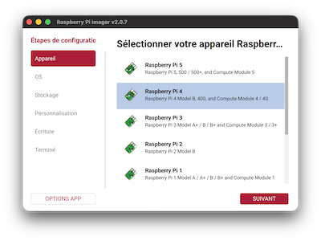

2. Sélectionner l'OS

Préférer Raspberry Pi OS Lite (64-bit), plus léger et sans interface graphique.

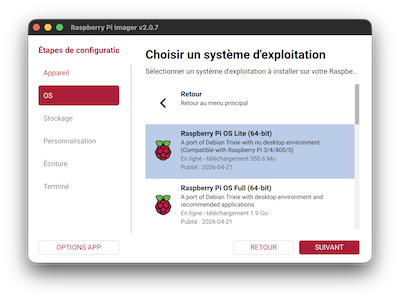

3. Sélectionner le stockage

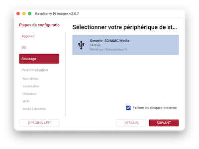

4. Personalisation

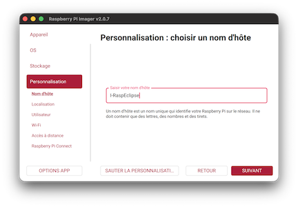
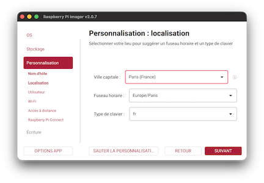

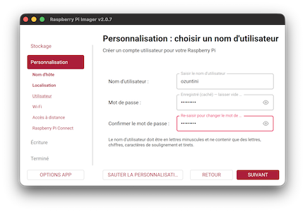
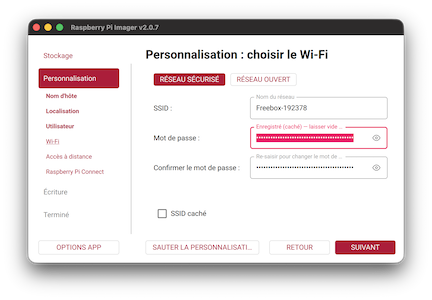

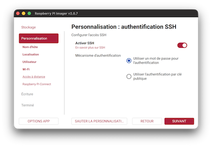
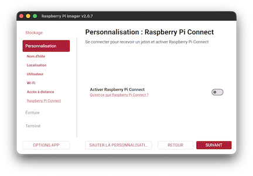

5. Ecrire sur la carte

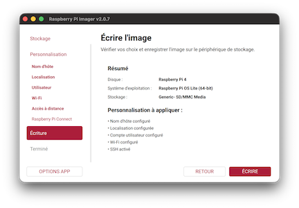
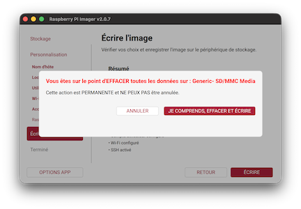

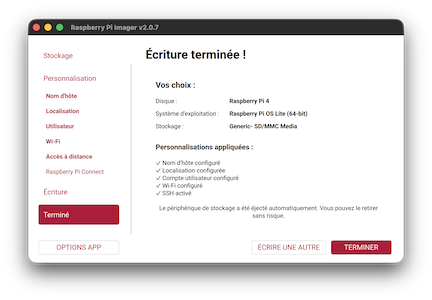


## Premiere connexion
Une fois la Pi démarrée se connecter en ssh.  
Pour votre confort supprimer la mise en commentaire des lignes ll, la et l dans le .bashrc.

### Installer GIT

```bash
sudo apt install git
```

### Cloner le premier repositorie

```bash
git clone https://github.com/ozuntini/Eclipse_Project.git
````

### Lancer l'installation
```bash
cd Eclipse_Project/
./install.sh
```
Laisser l'installation progresser.

Une fois l'installation terminée vous devez obtenir les messages suivants.  
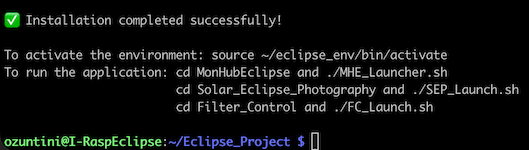

## Première utilisation


---
*** Error ***
An error occurred in the io-library ('Could not claim the USB device'): Could not claim interface 0 (Device or resource busy). Make sure no other program (gvfs-gphoto2-volume-monitor) or kernel module (such as sdc2xx, stv680, spca50x) is using the device and you have read/write access to the device.

Désactiver l’interface graphique de la RPI
#### Test d'une prise de vue
```bash
gphoto2 --capture-image
```
Si vous rencontrer l'erreur **Could not claim interface 0 (Device or resource busy)**.  
Il faut désactiver l'interface graphique.
```bash
sudo raspi-config

S1 System Options.
    └── S5 Boot...  
        └── IB1 Consol Text. 
sudo reboot
```


